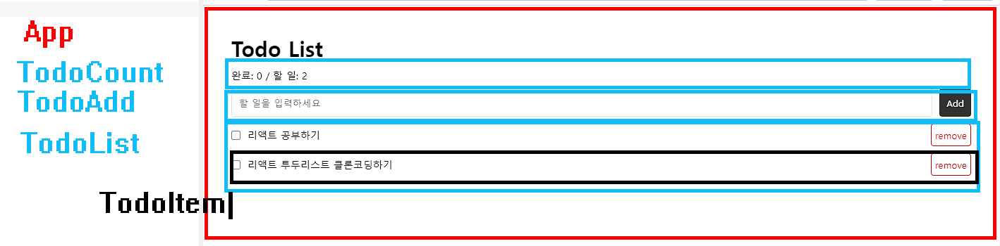

# react-todo



- font-face: Pretendard 지정

- 모듈 css 사용하기

## TodoAdd 추가하기

```js
// App.jsx
import { useState } from 'react';
import TodoAdd from './components/TodoAdd.jsx';
import './App.module.css';

export default function App() {
  // todos 배열로 초기화
  const [todos, setTodos] = useState([]);

  // 리스트 컴포넌트 만들기전 배열 확인
  console.log(todos);

  return (
    <main className="app">
      <h1>Todo List</h1>
      {/* todos배열, setTodos 상태변경함수 prop으로 전달 */}
      <TodoAdd todos={todos} setTodos={setTodos} />
    </main>
  );
}
```

```js
// components/TodoAdd.jsx
import { useRef, useState } from 'react';
import styles from './TodoAdd.module.css';

export default function TodoAdd({ todos, setTodos }) {
  const inputRef = useRef(null);
  const [nextId, setNextId] = useState(0);

  function handleAddTodo() {
    // 입력필드에 값이 있을 경우 실행
    if (inputRef.current.value.trim()) {
      setNextId(nextId + 1);
      setTodos([...todos, { id: nextId, text: inputRef.current.value, done: false }]);
    }
    inputRef.current.value = '';
  }
  console.log(todos);

  function handleEnter(e) {
    if (e.key === 'Enter') {
      handleAddTodo();
    }
  }

  return (
    <div className={styles.todo_add}>
      <input
        onKeyUp={handleEnter}
        ref={inputRef}
        type="text"
        placeholder="할 일을 입력하세요"
        title="할 일을 입력하세요"
      />
      <button type="button" onClick={handleAddTodo}>
        Add
      </button>
    </div>
  );
}
```

## TodoCount 추가하기

```js
// components/TodoCount.jsx
export default function TodoCount({ todos }) {
  // todos배열에서 todo객체의 done이 true인 요소 필터하여 새로운 배열 반환후 길이구함
  // todos state에 의해 계산된 complete은 반응성을 가지므로 state일 필요없음
  const complete = todos.filter((todo) => todo.done === true).length;

  return (
    <div className="todo_count">
      완료: {complete} / 할 일: {todos.length}
    </div>
  );
}
```

## TodoList 추가하기

```js
// components/TodoList.jsx
import TodoItem from './TodoItem.jsx';

export default function TodoList({ todos, setTodos }) {
  return (
    <ul className="todo_list">
      {/* todos배열 길이만큼 TodoItem을 새로운 배열에 넣어 반환 */}
      {todos.map((todo) => (
        // 리스트이므로 todo객체의 id를 key prop으로 전달
        // 배열요소, 배열, 배열변경함수 모두 전달
        <TodoItem key={todo.id} todo={todo} todos={todos} setTodos={setTodos} />
      ))}
    </ul>
  );
}
```

## TodoItem 추가하기

```js
// components/TodoItem.jsx
export default function TodoItem({ todo, todos, setTodos }) {
  function handleDone() {
    // todos배열요소 모두(t)와 todoItem호출시 전달된 todo.id가 같으면
    // { ...t, done: !t.done } 해당 객체 done 속성 변경하여 새로운 객체로 배열요소 업데이트
    // id가 같지않으면 원래 객체 그대로 전달하여 새로운 배열 생성후 setTodos를 통해 todos업데이트
    // 삼항연산에서 객체가 리턴되므로 () 묶어줌
    setTodos(
      todos.map((t) => (t.id === todo.id ? { ...t, done: !t.done } : t))
    );
  }

  function handleRemove() {
    // todos 배열요소와 todoItem호출시 전달된 todo의 id가 같지않은 요소로 새로운 배열 전달
    setTodos(todos.filter((t) => t.id !== todo.id));
  }

  return (
    <li>
      {/* todo.id와 check문자 연결하여 label htmlFor와 연결 */}
      <input id={`check${todo.id}`} type="checkbox" />
      {/* todo.done이 true면 on클래스 걸기 */}
      <label
        className={todo.done ? 'on' : ''}
        htmlFor={`check${todo.id}`}
        onClick={handleDone}
      >
        {todo.text}
      </label>
      <button type="button" className="remove_btn" onClick={handleRemove}>
        remove
      </button>
    </li>
  );
}
```
