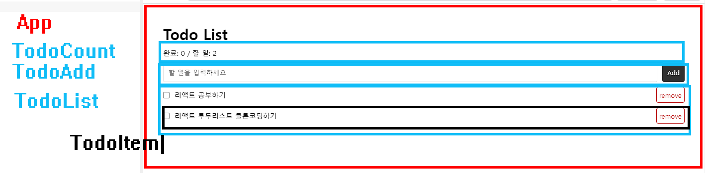

# react-todo



- font-face: Pretendard 지정

- 모듈 css 사용하기

## APP jsx

```js
// App.jsx

import { useState } from 'react';
import TodoCount from './components/TodoCount.jsx';
import TodoAdd from './components/TodoAdd.jsx';
import TodoList from './components/TodoList.jsx';
import styles from './App.module.css';

export default function App() {
  // todos 배열로 초기화
  const [todos, setTodos] = useState([]);

  // 리스트 컴포넌트 만들기전 배열 확인
  console.log(todos);

  return (
    <main className={styles.app}> // styles.app으로 생성
      <h1>Todo List</h1>
      <TodoCount todos={todos} />
      <TodoAdd todos={todos} setTodos={setTodos} />
      <TodoList todos={todos} setTodos={setTodos} />
    </main>
  );
}
```

```js
//import styles from './TodoAdd.module.css';
import { useRef } from 'react';

export default function TodoAdd({ todos, setTodos }) {
  // 데이터 입력값, 초기값
  const inputRef = useRef(null);
  const idRef = useRef(0);

  // idRef.current += 1;

  function handleAddTodo() {
    if (inputRef.current.value.trim()) {
      // 배열을 복사애서 새로 만들어야하기떄문에 ...spread연산자로 배열(todos)을 받아줘야함
      setTodos([
        ...todos,
        // 데이터 바뀐값
        { id: idRef.current++, text: inputRef.current.value, done: false },
      ]);
      // 배열에 데이터 입력후 input칸 초기화
      inputRef.current.value = '';
    }
  }

  return (
    <div className={styles.todo_add}>
      {/* preventDefault = 엔터시 세로고침 방지 */}
      <form onSubmit={(e) => e.preventDefault()}>
        <input
          // 데이터 입력된값
          ref={inputRef}
          type="text"
          placeholder="할 일을 입력하세요"
          title="할 일을 입력하세요"
        />
        {/* 엔터키 사용위해 type"submit" 해줘야함 */}
        <button type="submit" onClick={handleAddTodo}>
          Add
        </button>
      </form>
    </div>
  );
}
```

## TodoCount 추가하기

```js
//import styles from './TodoCount.module.css';

export default function TodoCount({ todos }) {
  // 배열요소중 done이 true인 요소만 새로운 배열로 생성
  const complete = todos.filter((todo) => todo.done === true).length;
  return (
    <div className={styles.todo_count}>
      완료: {complete} / 할 일: {todos.length}
    </div>
  );
}
 components/TodoCount.jsx
```

## TodoList 추가하기

```js
//import styles from './TodoList.module.css';
import TodoItem from './TodoItem';

export default function TodoList({ todos, setTodos }) {
  return (
    <ul className={styles.todo_list}>
      {todos.map((todo) => (
        <TodoItem key={todo.id} todo={todo} todos={todos} setTodos={setTodos} />
      ))}
    </ul>
  );
}
 components/TodoList.jsx
```

## TodoItem 추가하기

```js
// components/TodoItem.jsx
import styles from './TodoItem.module.css';
import { useId } from 'react';

export default function TodoItem({ todo, todos, setTodos }) {
  // 체크박스
  const inputId = useId();

  // 배열요소중 id가 같은 요소만 객체중 done값을 업데이트
  function handleDone() {
    setTodos(
      todos.map((t) => (t.id === todo.id ? { ...t, done: !t.done } : t))
    );
  }

  function handleRemove() {
    // todos배열 전체요소와 todo로 전달된 배열요소 각각의 id를 비교하여
    // 같지않은 요소만 새로운 배열로 전달
    setTodos(todos.filter((t) => t.id !== todo.id));
  }

  return (
    <li className={styles.todo_item}>
      <input id={inputId} type="checkbox" />
      <label
        className={todo.done ? styles.on : ''}
        htmlFor={inputId}
        onClick={handleDone}
      >
        {todo.text}
      </label>
      <button type="button" onClick={handleRemove}>
        remove
      </button>
    </li>
  );
}
```

## ## TodoAdd.module.css

.todo_add input[type='text'] {

  width: calc(100% - 80px);

  height: 40px;

  border: 1px solid #ddd;

  border-radius: 4px;

}

.todo_add button {

  height: 40px;

  border-radius: 4px;

  background: #333;

  color: #fff;

  padding: 0 10px;

  border: none;

  margin-left: 10px;

}

## TodoCount.module.css

.todo_count {

  margin: 10px 0;

  font-size: 14px;

}

## TodoItem.module.css

.todo_item {

  display: flex;

  margin-top: 10px;

  align-items: center;

}

.todo_item label {

  width: 100%;

  font-size: 14px;

}

.todo_item label.on {

  text-decoration: line-through;

  color: #666;

}

.todo_item button {

  height: 32px;

  color: var(--point-color1);

  border: 1px solid var(--point-color1);

  padding: 0 10px;

  background: none;

  border-radius: 4px;

}
